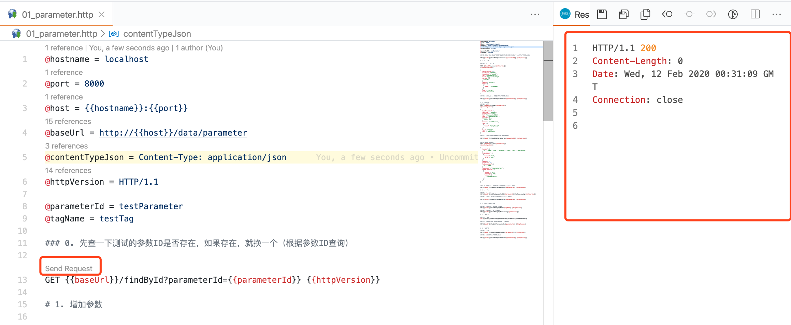

# HTTP接口测试说明

## 1. 安装VSC的REST Client插件

测试文档采用「Visual Studio Code」的「REST Client」插件编写。

插件地址：https://marketplace.visualstudio.com/items?itemName=humao.rest-client

## 2. 修改测试地址

安装好插件后，用`Visutal Studio Code`打开`.http`文件，修改以下信息，即可开始测试。

```
@hostname = localhost
@port = 8000
```

## 3. 测试流程

从上到下，依次点击「Send Request」，一步步测试。


点「Send Request」后，在右侧会有返回结果，见下图。



## 4. 注意事项

在每一个测试的结尾，都有清除测试数据的功能，建议都点完。

**特别说明：** 删除`influxdb`中的测试数据，一般耗时5～10秒，这是influxdb的特点，对「删除」支持较差，请耐心等待。